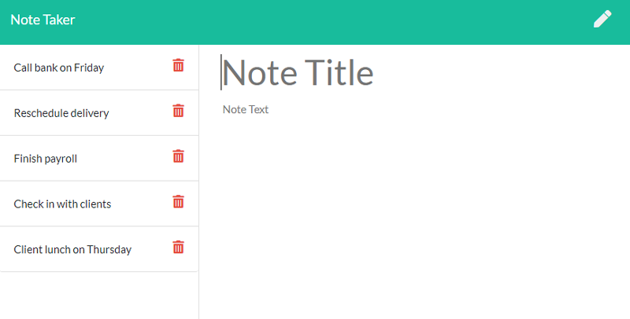

# Note Taker

## Note Taker utilizing Express.js to serve HTML pages and provide the backend for saving and deleting notes to a "database" json file. 

## Table of Contents

- [Installation](#Installation)
- [Usage](#Usage)
- [Credits](#Credits)
- [License](#License)

## Installation

Install the Following Dependencies:
Node.js is required to run the backend server, as well as using the 'fs' and 'path' modules used in the server file. I also recommend installing nodemon if you want to do any work on this repo; it will auto restart the server for you. 

Testing Functionallity:
Since this was a boilerplate homework, no tests were done

## Usage

Feel free to fork if you want, but I won't be accepting any commits into this repo. 

## Credits

Matt Reisdorf:
Github - [MattReisdorf](https://github.com/MattReisdorf)

Jeremy Joanet:
Github - [Vygoth](https://github.com/Vygoth)

Tom Siemion:
Github - [rotosti](https://github.com/rotosti)

## License

The Unlicense

http://unlicense.org/
